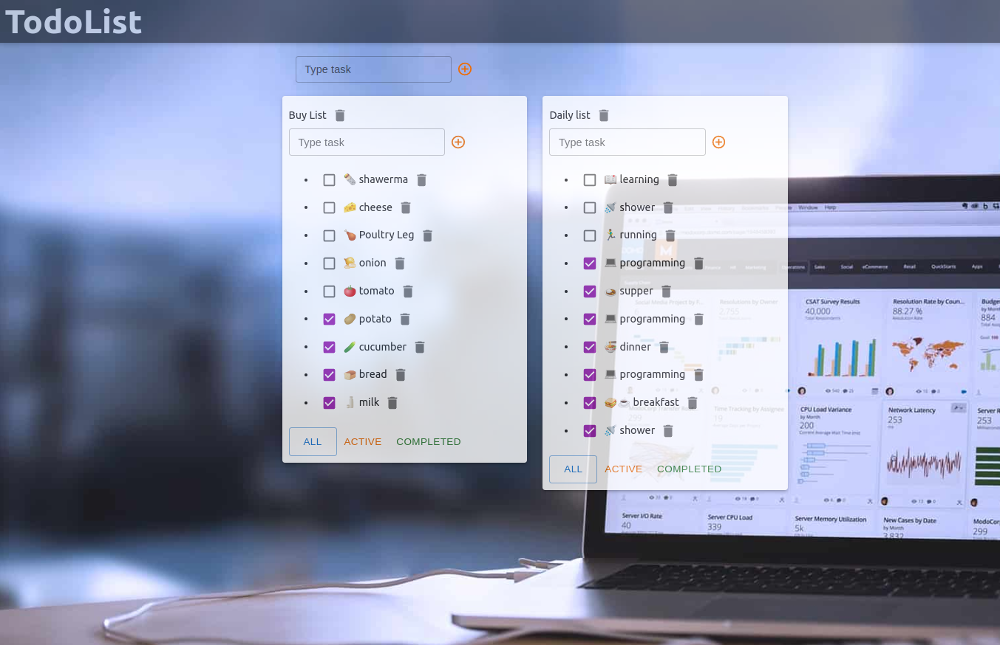

<h1 align="center">Todo list</h1>
<h2 align="center">

</h2>

<p align="center">

[//]: # ()


</p>


<h2 align="center"><a  href="https://msaserj.github.io/inc-todolist">Live Demo</a></h2>

## Description

**This is a tutorial project - todolist. The interaction takes place with a real backend.**

<p align="center"></p>

## About the project.

What is implemented here?

1. Authorization.
2. CRUD operations with lists and todos.
3. Material UI layout.
4. Error processing.

You can also login or register use socialnetwork project form 
[here](https://msaserj.github.io/inc-socialnetwork)

## Technologies

**React**,
**Redux**,
**Redux-toolkit**,
**Material-UI**,
**TS**,
**SCSS**,
**Storybook**

## Project setup

```
npm install
npm run serve
```
#### use yarn
```
yarn
yarn start
```

## Future scope

- Add registration flow.
- Rewrite all reducers to redux-toolkit,
- May be add drug and drop.

## My Home Page

[Sergei Minko aka msaserj](https://msaserj.ru)